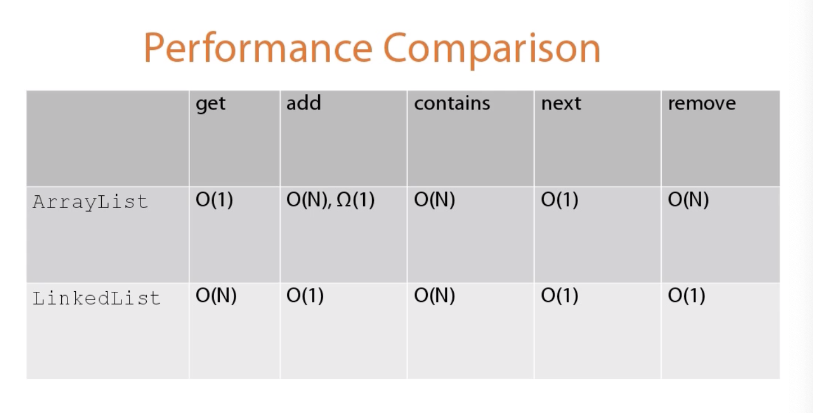

#  Lists *Iteration Order*

**Key Features**

* Lists are collections with iteration order
* each item has an index

*Methods:*
* `add`
* `get`
* `remove` 
* `set`
* `addAll`
* `indexOf`
* `lastIndexOf`
* `subList`

**ArrayList**
 * good general purpose Implementation 
 * use as default
 * more cpu cache sympahtic
 * fast out of the box
  
**LinkedList**  
* each element has head and tail 
* Worse performance for many operations
* Use when adding elements at start
* Or when add/removing alot



## Collection List methods
- `Collections.min(collectionVaribable)`
    get smallest value
- `Collections.max(collectionVaribable)`
    get highest value
- `Collections.reverse(collectionVariable)`
    reverse the collection
- `Collections.sort(collectionVariable, fieldToSortBy)`    
- `Collections.shuffle(collectionVariable)`
    shuffle order of elements
- `Collections.swap(list, i, j)`
    Swap the order of items via index

## LinkedList

create a linked list 
```java
LinkedList<String> linkedList = new LinkedList<>(); 
```

## ListIterator 

```java
import java.util.ListIterator; 
```

Create iterator to move through the linked list 
```java
Iterator <String> iterator = linkedList.iterator(); 
```
check that there is a next item 
```java
iterator.hasNext(); 
```
check there is a previous element 
```java
iterator.hasPrevious();
```
get the the next item in linked list 
```java
iterator.next(); 
```
move back 
```java
iterator.previous(); 
```
insert specificied element into the list immediately before the element that would be returned by `next` and after `previous`
```java
iterator.add("new element");
```

**Oracle docs:**
- [Array List](https://docs.oracle.com/javase/8/docs/api/java/util/ArrayList.html)
 - [Linked List](https://docs.oracle.com/javase/8/docs/api/java/util/LinkedList.html)
