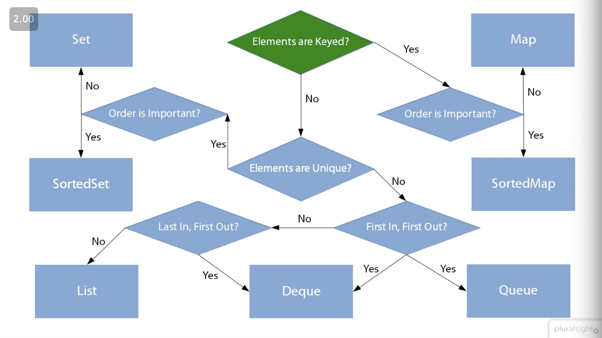

# Collections

### The Problem with Arrays

* fix size, need to make add and remove methods to add and remove
* no uniqueness
* lack of high level features

### why collections? 

* Java collections ships with JDK 
* Extensively used 
* implementing data structures can be hard
* data structures diverse
  * ordering 
  * uniqueness
  * pairs
  
---

## Defining and Iterating 

### Collections of Collections

All collections extend the Collection interface
* List
  * ArrayList
  * LinkedList 
* Set -> SortedSet
  * HashSet
  * TreeSet
* Queue -> Deque 
  * PriortyQueue
  * LinkedList 
  * ArrayDeque
* Map -> SortedMap 
  * hashMap
  * TreeMAp



Interfaces vs implementation 

**interface** 
* Multiple data Structure
* Functional Characteristic
* Prefer as Variable 
* Often has a popular implementation 

**Implementation**
* specific Data Structure
* Performance Characteristics
* Concrete and Instantiable 

```java
Collection<Product> products = new ArrayList<>();   
product.add(door)
product.add(floorPanel);

// old way
final Iterator<Product> productIterator = products.iterator();
while(productIterator.hasNext()) 
{
  Product product = productIterator.next(); 
  System.out.printlin(product); 
}

// can use for loop now - does the same as iterator
for (Product product : products)
{
  System.out.printlin(product); 
}
// what an iterator can do that a for loop can't
final Iterator<Product> productIterator = products.iterator();
while(productIterator.hasNext()) 
{
  Product product = productIterator.next(); 
  if (product.getWeight() > 20) 
  {
    System.out.printlin(product); 
  }
  else
  {
    productIterator.remove();  
  }
}
```
methods that can be called on collection 
`products.size()` -> return the length of the collection as a number
`products.isEmpty()` -> returns a boolean
`products.contains(window)` -> returns a boolean
`products.removeAll(otherProducts)` -> takes a collection, returns a collection

If you are looping over a collection with a for loop do not modify it. Use an iterator instead.  


---
## Iteration Order: Lists

**Key Features**

* Lists are collections with iteration order
* each item has an index

*Methods:*
* `add`
* `get`
* `remove` 
* `set`
* `addAll`
* `indexOf`
* `lastIndexOf`
* `subList`

**ArrayList**
 * good general purpose Implementation 
 * use as default
 * more cpu cache sympahtic
 * fast out of the box
  
**LinkedList**  
* each element has head and tail 
* Worse performance for many operations
* Use when adding elements at start
* Or when add/removing alot

*performance comparision*


---
## Uniqueness: Sets

Sets are collections of distinct elements. There are no duplicates. 

### Set Features

### Worked example

### Set Implementations

### SortedSet Feature


## Modification Order: queues and deques 

## Collections of Pairs: Maps

## Collection Operations


